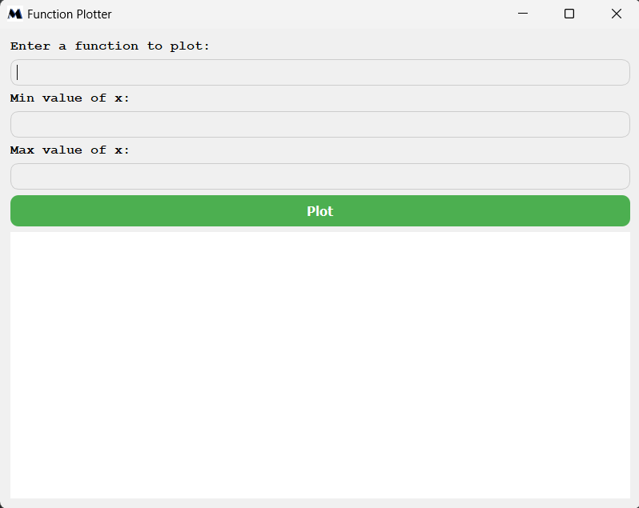
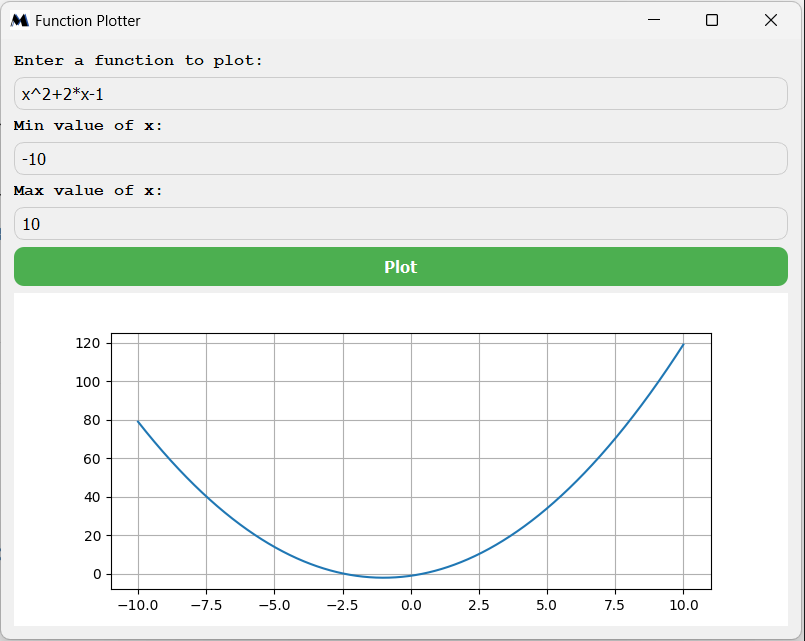
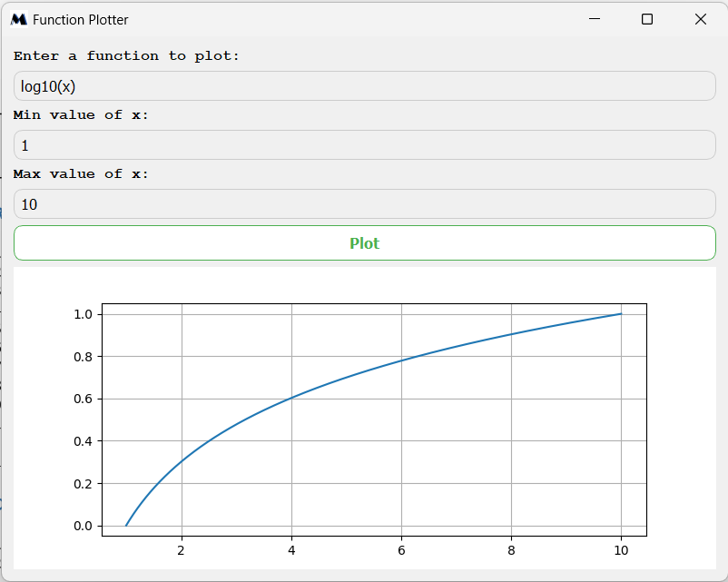
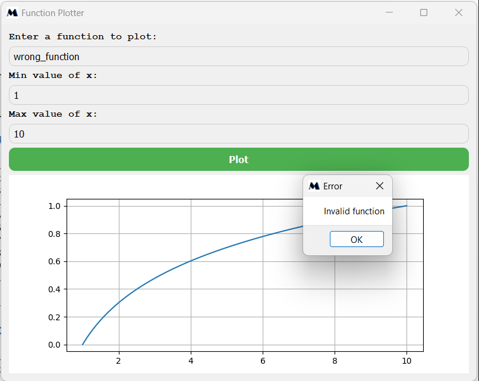

# Function Plotter

A simple and interactive function plotting application built with Python, PySide2, and Matplotlib.



## Features

- Plot mathematical functions with a user-friendly GUI
- Support for basic arithmetic operations and common mathematical functions
- Dynamic x-axis range selection
- Error handling and input validation
- Stylish and responsive interface

## Requirements

- Python 3.6+
- PySide2
- Matplotlib
- NumPy

## Installation

1. Clone this repository:
```sh
git clone https://github.com/dodzii/python-function-plotter
cd python-function-plotter
```

2. Install the required packages:
```sh
pip install -r requirements.txt
```

## Usage

Run the application:
```sh
python main.py
```

1. Enter a mathematical function in the top text field. Supported operations include:
   - Basic arithmetic: +, -, *, /, ^(exponentiation)
   - Functions: sqrt(), log10()
   - Use 'x' as the variable

2. Set the minimum and maximum values for the x-axis range.

3. Click the "Plot" button to generate the graph.

## Examples

Try these functions:

- `x^2 + 2*x - 1`
- `sin(x)`
- `log10(x)`
- `sqrt(x)`
<br />
<br />







## Error Handling

The application includes error handling for:
- Empty input fields
- Invalid x-axis range (min > max)
- Invalid mathematical expressions

## Testing

This project includes a test suite using pytest. To run the tests:

```sh
pytest _test.py
```

The test suite covers:
- Function parsing and evaluation
- UI element initialization
- Plot generation for valid inputs
- Error handling for invalid inputs


## License

This project is licensed under the MIT License - see the [LICENSE](LICENSE) file for details.

## Acknowledgements

- [PySide2](https://wiki.qt.io/Qt_for_Python) for the GUI framework
- [Matplotlib](https://matplotlib.org/) for plotting capabilities
- [NumPy](https://numpy.org/) for numerical computations
